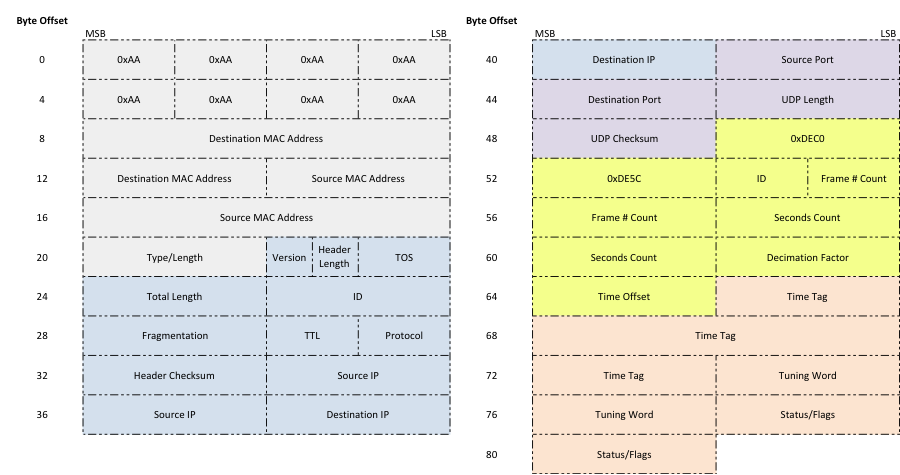

dr_tengine.py
=============

``dr_tengine.py`` is a combination T-engine and recording pipeline for the voltage
beam mode.  This pipeline captures packetized beam data from the digital system,
down selects the frequency coverage to match what is requested by the observer,
converts the data back into the time domain, and writes raw DRX files.

Structure
---------

The pipeline is written in the Bifrost framework and has four blocks:  
``CaptureOp``, ``ReChannelizerOp``, ``TEngineOp``, and ``WriterOp``.

 * ``CaptureOp`` - This is the data capture block which is responsible for capturing
   the beam packets from the digital system, ordering them in time and frequency,
   and writing the organized data to a Bifrost ring.
 * ``ReChannelizerOp`` - This reads in the beam data and performs an inverse FFT
   followed by an FFT to change the channel width of the data to 50 kHz.
 * ``TEngineOp`` - This reads in the re-channelized data, down selects the frequency
   range, and performs an inverse FFT to create time domain voltage data.
 * ``WriterOp`` - This reads in time domain data and writes raw DRX files to disk.

 The pipeline is designed such that there is one pipeline per voltage beam.  For the
 expected number un-averaged beams created by the digital system this equates to 2
 pipeline instances.

Control Commands
----------------

The ``dr_tengine.py`` pipeline supports six commands: ``ping``, ``sync``, ``record``,
``cancel``, ``delete``, and ``drx``.

  * ``ping`` - This command simply replies which is helpful to see if the pipeline
    is responsive.  There are no required or optional arguments.  Returns a response
    of "pong".
  * ``sync`` - This command sets the system time via NTP.  The required arguments to
    this command are:
  
     * ``server`` - a NTP server name or IP address to sync against.
   
    There are no optional arguments.  The command returns the sync status.
  * ``record`` - This schedules a recording to take place.  The required arguments to
    this command are:
    
     * ``start_mjd`` - an integer MJD value for when the recording will start,
     * ``start_mpm`` - an integer number of milliseconds past midnight value on the
       MJD specified in ``start_mjd`` for when the recording will start, and
     * ``duration_ms`` - the number of milliseconds to record data for.
     
    There are no optional arguments.  The command returns the name of the file that
    will be written.  The name will be of the format "<mjd>_<MCS sequence id>".
  * ``cancel`` - This cancels a previously scheduled or active recording.  The
     required arguments to this command are:
     
      * `queue_id` - an entry number in the recording queue to cancel.
      
    There are no optional arguments.  The command returns the base name for the files
    that were to have been written/were written that is associated with the queue
    entry.
  * ``delete`` - This deletes a file from the recording directory.  The required
    arguments to this command are:
    
     * ``file_number`` - an entry number in the file list of the recording directory.
     
    There are no optional arguments.  The command returns the name of the file that
    was deleted.
  * ``drx`` - This controls the down selection in frequency for the T-engine as
    as well as the quantization gain when moving to 4+4-bit complex integers for
    the output.  The required arguments to
    this command are:
    
     * ``beam`` - an integer of the voltage beam number of control,
     * ``tuning`` - an integer of the tuning number, 1 or 2, within the voltage
       beam to control, 
     * ``central_freq`` - the central frequency of the tuning in Hz,
     * ``filter`` - an integer for the output bandwidth code, 7 = 19.6 MHz, and
     * ``gain`` - an integer for the quantization gain.
     
    There is a single optional argument of ``subslot`` which controls when the
    command is implemented within the second.  If not specified the default of 0
    is used.
    
Monitoring Points
-----------------

There are several monitoring points for the pipeline.  All monitoring points live
under the etcd key "/mon/drt#", where # is the power beam number that is being
recorded.
  
  * /mon/drt#/bifrost
  
   * pipeline_lag - The lag between the system time and the
     timestamps for data in the pipeline.
   * max_acquire - The maximum span/gulp acquire time across
     all blocks in the pipeline.
   * max_process - The maximum span/gulp processing time
     across all blocks in the pipeline.
   * max_reserve - The maximum span/gulp reserve time across
     all blocks in the pipeline.
   * rx_rate - Packet capture rate for the pipeline.
   * rx_missing - Fraction of missing packets for the pipeline.
   
  * /mon/drt#/storage
 
   * active_disk_size - The size of the disk where the
     recording directory resides.
   * active_disk_free - The amount of free space on the disk
     where the recording directory resides.
   * active_directory - The current recording directory.
   * active_directory_size - The size of all files in the
     recording directory.
   * active_directory_count - The number of files in the
     recording directory.
  
  * /mon/drt#/summary - An overall status of the pipeline.  Possible values
    are "normal", "warning", and "error".
  * /mon/drt#/info - A more detailed explanation of the summary condition.
     

Data Format
-----------

The DRX format is a
`Mark 5C <http://www.haystack.mit.edu/tech/vlbi/mark5/mark5_memos/057.pdf>`_-based
packetized format for storing complex voltage timeseries data.  The header for
these packets are defined as:

The only portion of this header that is saved to disk by ``dr_tengine.py`` is the
yellow Mark 5C portion in the above image.  Each data frame will contain data of
one polarization (X or Y), one DRX tuning, and 4096 samples stored as 4+4 bit
complex integers (signed two's complement).  The total size of a data packet is 4128
bytes.  The Mark 5C header will include an ID field that identifies which
polarization and tuning is associated with the data, as described in the table
below.

The Mark 5C header will include Frame Count and Seconds Count fields for
compatibility purposes but both of these fields will always be set to zero. The
Data Frame header will include a Decimation Factor field that describes the
decimation factor used in producing the output data. The output sample rate is
`fs`/Decimation Factor. The Data Frame header will also include a Time Offset field
that provides the known time offset (Tnom in
`LWA Memo 151 <https://leo.phys.unm.edu/~lwa/memos/memo/lwa0151.pdf>`_), in units of 1/`fs`
since the beginning of the second. The Data Frame will include a Time field (t1 in
`LWA Memo 151 <https://leo.phys.unm.edu/~lwa/memos/memo/lwa0151.pdf>`_) in units of
1/`fs` since 1970 January 1 00:00 UTC. For the i-th sample of the frame, the time
at that sample is related to the frame time tag through:

.. math::
  t_i = \mbox{time} + (i-1) \times \frac{\mbox{DecimationFactor}}{f_s}.
  
The Data Frame will also include a tuning word, a unsigned 32-bit integer, which
specifies the central tuning of the DRX data. This tuning word, `w`, can be
converted to a frequency in Hz via:

.. math::
  f = \frac{w}{2^{32}} f_s,

where `fs` is defined as 196 MHz. The status/flags field in the Data Frame is
currently unimplemented in the DRX firmware and is set to zero for all frames.

Each sample is 8 bits total (4 bits I and 4 bits Q). Therefore 4096 samples
require 4096 bytes. Inside each 32-bit word, the data will be arranged in the
following order (from MSB to LSB)::

    I0 (bits 31-28), Q0 (bits 27-24), I1 (bits 23-20), Q1 (bits 19-16), 
    I2 (bits 15-12), Q2 (bits 11-8), I3 (bits 7-4), Q3 (bits 3-0).

The numbers in paraphrases are the bits within each sample such that 0 is the LSB.

.. csv-table:: DRX_ID Numbering
  :header: DRX_BEAM,DRX_TUNING,Polarization, DRX_ID
  
  1, 1, X, 9
  1, 1, Y, 137
  1, 2, X, 17
  1, 2, Y, 145
  2, 1, X, 10
  2, 1, Y, 138
  2, 2, X, 18
  2, 2, Y, 146
  3, 1, X, 11
  3, 1, Y, 139
  3, 2, X, 19
  3, 2, Y, 147
  4, 1, X, 12
  4, 1, Y, 140
  4, 2, X, 20
  4, 2, Y, 148

DRX Numbering is as follows:  DRX_ID is an unsigned 8-bit integer.

 * Bits 0-2 are used to represent DRX_BEAM,
 * bits 3-5 are used to represent DRX_TUNING,
 * bit 6 is reserved for future use, and
 * bit 7 is used to represent polarization.
